[](https://classroom.github.com/a/YFgwt0yY)
# MiniTorch Module 2


* Docs: https://minitorch.github.io/

* Overview: https://minitorch.github.io/module2/module2/

This assignment requires the following files from the previous assignments. You can get these by running

```bash
python sync_previous_module.py previous-module-dir current-module-dir
```

The files that will be synced are:

        minitorch/operators.py minitorch/module.py minitorch/autodiff.py minitorch/scalar.py minitorch/scalar_functions.py minitorch/module.py project/run_manual.py project/run_scalar.py project/datasets.py


Dataset:

- Simple

Hyperparameters:

- learning rate: 0.1
- epochs: 500
- hidden layers: 5

Time per epoch: 0.077s

Epoch: 0/500, loss: 0, correct: 0
Epoch: 10/500, loss: 33.83016250383916, correct: 32
Epoch: 20/500, loss: 33.13836924662788, correct: 34
Epoch: 30/500, loss: 32.44929018918399, correct: 35
Epoch: 40/500, loss: 31.607862593788848, correct: 39
Epoch: 50/500, loss: 30.53871998879265, correct: 43
Epoch: 60/500, loss: 29.163191913586886, correct: 44
Epoch: 70/500, loss: 27.425278071105865, correct: 46
Epoch: 80/500, loss: 25.33280163856704, correct: 46
Epoch: 90/500, loss: 23.10391372232391, correct: 47
Epoch: 100/500, loss: 21.00903924711931, correct: 47
Epoch: 110/500, loss: 19.049919954954067, correct: 47
Epoch: 120/500, loss: 17.30107170165706, correct: 49
Epoch: 130/500, loss: 15.812989869964522, correct: 50
Epoch: 140/500, loss: 14.5641824455749, correct: 50
Epoch: 150/500, loss: 13.519560850828324, correct: 50
Epoch: 160/500, loss: 12.624529021243875, correct: 50
Epoch: 170/500, loss: 11.851294540196355, correct: 50
Epoch: 180/500, loss: 11.173229019984076, correct: 50
Epoch: 190/500, loss: 10.57801317678328, correct: 50
Epoch: 200/500, loss: 10.049516849008052, correct: 50
Epoch: 210/500, loss: 9.577988326988686, correct: 50
Epoch: 220/500, loss: 9.15631072825993, correct: 50
Epoch: 230/500, loss: 8.777811035593045, correct: 50
Epoch: 240/500, loss: 8.435446162960268, correct: 50
Epoch: 250/500, loss: 8.124115359445957, correct: 50
Epoch: 260/500, loss: 7.8396868387688015, correct: 50
Epoch: 270/500, loss: 7.578147729917809, correct: 50
Epoch: 280/500, loss: 7.336297410478499, correct: 50
Epoch: 290/500, loss: 7.112618171798611, correct: 50
Epoch: 300/500, loss: 6.903606710123135, correct: 50
Epoch: 310/500, loss: 6.707389150035056, correct: 50
Epoch: 320/500, loss: 6.522355776693649, correct: 50
Epoch: 330/500, loss: 6.347243446441253, correct: 50
Epoch: 340/500, loss: 6.180994856538031, correct: 50
Epoch: 350/500, loss: 6.022714083198679, correct: 50
Epoch: 360/500, loss: 5.87164301974347, correct: 50
Epoch: 370/500, loss: 5.727109244495333, correct: 50
Epoch: 380/500, loss: 5.588546991226468, correct: 50
Epoch: 390/500, loss: 5.455476888822638, correct: 50
Epoch: 400/500, loss: 5.327485460629466, correct: 50
Epoch: 410/500, loss: 5.204212621937046, correct: 50
Epoch: 420/500, loss: 5.085334698579253, correct: 50
Epoch: 430/500, loss: 4.970574073619472, correct: 50
Epoch: 440/500, loss: 4.859692192422782, correct: 50
Epoch: 450/500, loss: 4.752457405722511, correct: 50
Epoch: 460/500, loss: 4.648675434625256, correct: 50
Epoch: 470/500, loss: 4.54817157973002, correct: 50
Epoch: 480/500, loss: 4.450787972185748, correct: 50
Epoch: 490/500, loss: 4.356550627123408, correct: 50
Epoch: 500/500, loss: 4.265183021026202, correct: 50


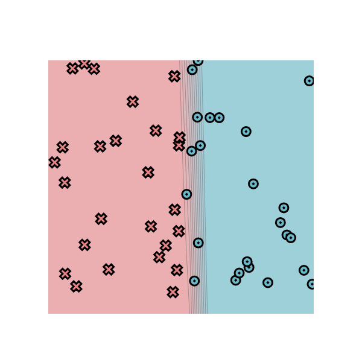

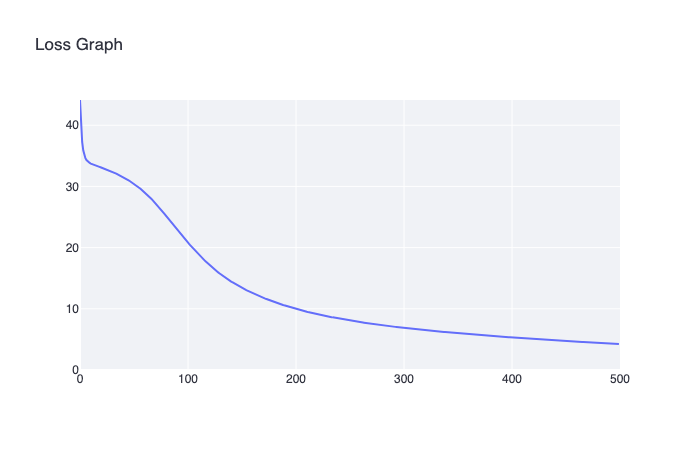


Dataset:

- Diag

Hyperparameters:

- learning rate: 0.1
- epochs: 500
- hidden layers: 6

Time per epoch: 0.098s

Epoch: 0/500, loss: 0, correct: 0
Epoch: 10/500, loss: 36.5437892330037, correct: 9
Epoch: 20/500, loss: 23.76628724534756, correct: 41
Epoch: 30/500, loss: 20.375188092720716, correct: 41
Epoch: 40/500, loss: 18.471466895307497, correct: 41
Epoch: 50/500, loss: 16.623300624520905, correct: 41
Epoch: 60/500, loss: 15.252501447424937, correct: 41
Epoch: 70/500, loss: 13.990390427666682, correct: 42
Epoch: 80/500, loss: 12.848140716878973, correct: 43
Epoch: 90/500, loss: 11.804477238875588, correct: 45
Epoch: 100/500, loss: 10.851736911125675, correct: 46
Epoch: 110/500, loss: 9.995041798334347, correct: 46
Epoch: 120/500, loss: 9.232002334875432, correct: 47
Epoch: 130/500, loss: 8.556760810924901, correct: 48
Epoch: 140/500, loss: 7.960590657001263, correct: 49
Epoch: 150/500, loss: 7.434540628238675, correct: 49
Epoch: 160/500, loss: 6.970112526656734, correct: 49
Epoch: 170/500, loss: 6.559148080245798, correct: 49
Epoch: 180/500, loss: 6.19474918067579, correct: 49
Epoch: 190/500, loss: 5.877110490532117, correct: 49
Epoch: 200/500, loss: 5.592504820938026, correct: 49
Epoch: 210/500, loss: 5.334303032351103, correct: 49
Epoch: 220/500, loss: 5.099012403692321, correct: 49
Epoch: 230/500, loss: 4.883705149700348, correct: 49
Epoch: 240/500, loss: 4.68633728227546, correct: 49
Epoch: 250/500, loss: 4.505429822714401, correct: 49
Epoch: 260/500, loss: 4.338582602642717, correct: 49
Epoch: 270/500, loss: 4.1848751995308975, correct: 49
Epoch: 280/500, loss: 4.042502855204139, correct: 49
Epoch: 290/500, loss: 3.9111514286167575, correct: 49
Epoch: 300/500, loss: 3.7913880187562703, correct: 49
Epoch: 310/500, loss: 3.679497492249463, correct: 49
Epoch: 320/500, loss: 3.574728204009386, correct: 49
Epoch: 330/500, loss: 3.476509133385577, correct: 49
Epoch: 340/500, loss: 3.384278070750054, correct: 50
Epoch: 350/500, loss: 3.297515045778913, correct: 50
Epoch: 360/500, loss: 3.215797809408857, correct: 50
Epoch: 370/500, loss: 3.1387419460341057, correct: 50
Epoch: 380/500, loss: 3.065988137205416, correct: 50
Epoch: 390/500, loss: 2.9972615967681966, correct: 50
Epoch: 400/500, loss: 2.932204727128842, correct: 50
Epoch: 410/500, loss: 2.870557231825753, correct: 50
Epoch: 420/500, loss: 2.8120994128203254, correct: 50
Epoch: 430/500, loss: 2.757497932100628, correct: 50
Epoch: 440/500, loss: 2.7059582430214, correct: 50
Epoch: 450/500, loss: 2.6568709599360165, correct: 50
Epoch: 460/500, loss: 2.6100565729842726, correct: 50
Epoch: 470/500, loss: 2.5653762025154894, correct: 50
Epoch: 480/500, loss: 2.523128855342904, correct: 50
Epoch: 490/500, loss: 2.483039890343362, correct: 50
Epoch: 500/500, loss: 2.4447155406145757, correct: 50


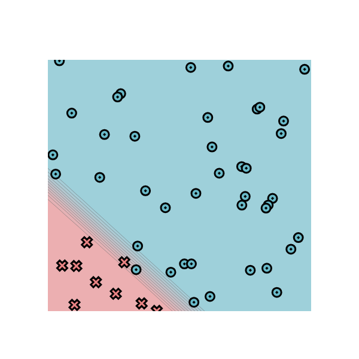

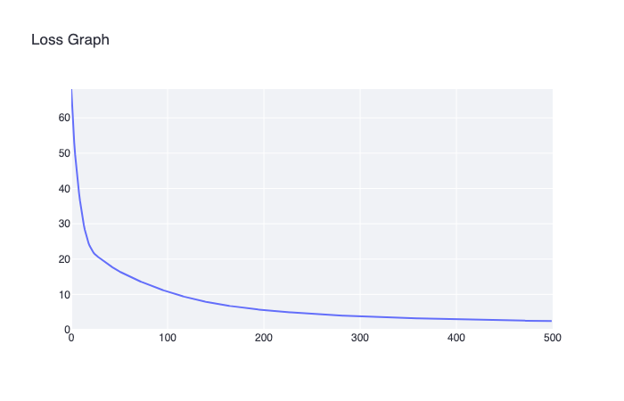


Dataset:

- Split

Hyperparameters:

- learning rate: 0.1
- epochs: 800
- hidden layers: 8

Time per epoch: 0.149s


Epoch: 0/500, loss: 0, correct: 0
Epoch: 10/800, loss: 27.812525780474633, correct: 36
Epoch: 20/800, loss: 27.569794142779983, correct: 36
Epoch: 30/800, loss: 27.342460999282057, correct: 36
Epoch: 40/800, loss: 27.111109678185144, correct: 36
Epoch: 50/800, loss: 26.810616795244723, correct: 36
Epoch: 60/800, loss: 26.508832505088353, correct: 36
Epoch: 70/800, loss: 26.2302331549472, correct: 38
Epoch: 80/800, loss: 25.93491670070048, correct: 40
Epoch: 90/800, loss: 25.606694250114888, correct: 41
Epoch: 100/800, loss: 25.267222444794893, correct: 41
Epoch: 110/800, loss: 24.91786901723873, correct: 42
Epoch: 120/800, loss: 24.56971543209811, correct: 42
Epoch: 130/800, loss: 24.19756627173874, correct: 42
Epoch: 140/800, loss: 23.82476420942368, correct: 42
Epoch: 150/800, loss: 23.462670811035245, correct: 42
Epoch: 160/800, loss: 23.123574619969187, correct: 42
Epoch: 170/800, loss: 22.7888758046255, correct: 42
Epoch: 180/800, loss: 22.46124161324194, correct: 42
Epoch: 190/800, loss: 22.1327241216507, correct: 42
Epoch: 200/800, loss: 21.80441200587314, correct: 43
Epoch: 210/800, loss: 21.47770641166561, correct: 43
Epoch: 220/800, loss: 21.15582397032609, correct: 43
Epoch: 230/800, loss: 20.834588215347804, correct: 43
Epoch: 240/800, loss: 20.51745541034449, correct: 43
Epoch: 250/800, loss: 20.203167940363024, correct: 44
Epoch: 260/800, loss: 19.899363970630596, correct: 44
Epoch: 270/800, loss: 19.595155325848452, correct: 44
Epoch: 280/800, loss: 19.2818818480821, correct: 44
Epoch: 290/800, loss: 18.963126531973803, correct: 44
Epoch: 300/800, loss: 18.638973002894723, correct: 44
Epoch: 310/800, loss: 18.309754789368185, correct: 44
Epoch: 320/800, loss: 17.976636759250823, correct: 44
Epoch: 330/800, loss: 17.640484549399744, correct: 44
Epoch: 340/800, loss: 17.28553144605295, correct: 44
Epoch: 350/800, loss: 16.85851423275744, correct: 44
Epoch: 360/800, loss: 16.398635481777315, correct: 44
Epoch: 370/800, loss: 15.933817955132243, correct: 44
Epoch: 380/800, loss: 15.478969791216148, correct: 44
Epoch: 390/800, loss: 15.06919827214818, correct: 44
Epoch: 400/800, loss: 14.678950678048688, correct: 44
Epoch: 410/800, loss: 14.278334032686432, correct: 44
Epoch: 420/800, loss: 13.785169635404422, correct: 44
Epoch: 430/800, loss: 12.587351474907502, correct: 44
Epoch: 440/800, loss: 11.844091665539473, correct: 44
Epoch: 450/800, loss: 11.287513178993812, correct: 45
Epoch: 460/800, loss: 10.797376802917062, correct: 45
Epoch: 470/800, loss: 10.370227772653669, correct: 46
Epoch: 480/800, loss: 9.975436515938268, correct: 47
Epoch: 490/800, loss: 9.603037939063615, correct: 47
Epoch: 500/800, loss: 9.253914581122451, correct: 47
Epoch: 510/800, loss: 8.931732956003833, correct: 47
Epoch: 520/800, loss: 8.618417775516791, correct: 48
Epoch: 530/800, loss: 8.327335632398723, correct: 48
Epoch: 540/800, loss: 8.056003328261717, correct: 48
Epoch: 550/800, loss: 7.800431803258729, correct: 48
Epoch: 560/800, loss: 7.560037515121156, correct: 48
Epoch: 570/800, loss: 7.334327025817903, correct: 48
Epoch: 580/800, loss: 7.123135609464292, correct: 48
Epoch: 590/800, loss: 6.923600554683644, correct: 48
Epoch: 600/800, loss: 6.733198322674887, correct: 48
Epoch: 610/800, loss: 6.553691545731575, correct: 48
Epoch: 620/800, loss: 6.379972776927392, correct: 48
Epoch: 630/800, loss: 6.215836527804201, correct: 48
Epoch: 640/800, loss: 6.05878811835461, correct: 48
Epoch: 650/800, loss: 5.9087749214849135, correct: 48
Epoch: 660/800, loss: 5.76505126507654, correct: 48
Epoch: 670/800, loss: 5.627605746155607, correct: 48
Epoch: 680/800, loss: 5.495705794302658, correct: 49
Epoch: 690/800, loss: 5.366389393199566, correct: 49
Epoch: 700/800, loss: 5.243537936468801, correct: 49
Epoch: 710/800, loss: 5.1258409518472865, correct: 49
Epoch: 720/800, loss: 5.01268402372699, correct: 49
Epoch: 730/800, loss: 4.9042953654005235, correct: 49
Epoch: 740/800, loss: 4.80056697777582, correct: 49
Epoch: 750/800, loss: 4.699984337025196, correct: 49
Epoch: 760/800, loss: 4.600584375148256, correct: 50
Epoch: 770/800, loss: 4.489894047494623, correct: 50
Epoch: 780/800, loss: 4.383348771388795, correct: 50
Epoch: 790/800, loss: 4.259010552651592, correct: 50
Epoch: 800/800, loss: 4.122730719766323, correct: 50


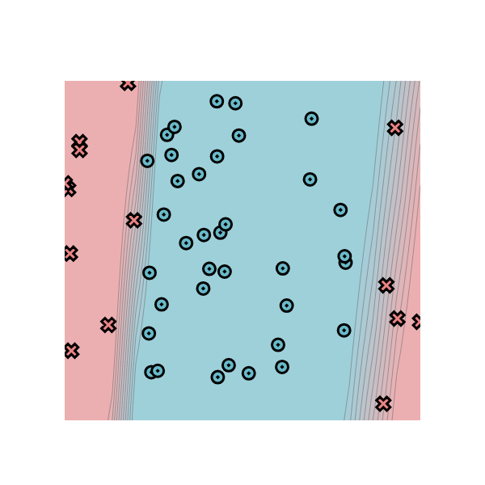

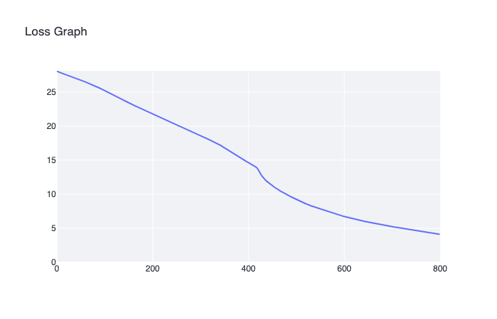

Dataset:

- Xor

Hyperparameters:

- learning rate: 0.5
- epochs: 1200
- hidden layers: 8

Time per epoch: 0.148s

Epoch: 0/1200, loss: 0, correct: 0
Epoch: 10/1200, loss: 33.826661827188204, correct: 29
Epoch: 20/1200, loss: 33.56887013721582, correct: 29
Epoch: 30/1200, loss: 33.38704734502404, correct: 29
Epoch: 40/1200, loss: 33.252648366139546, correct: 33
Epoch: 50/1200, loss: 33.12429589976309, correct: 34
Epoch: 60/1200, loss: 32.98631875578956, correct: 36
Epoch: 70/1200, loss: 32.800968654683885, correct: 36
Epoch: 80/1200, loss: 32.511630223818514, correct: 39
Epoch: 90/1200, loss: 32.091496886791504, correct: 38
Epoch: 100/1200, loss: 31.475296011072956, correct: 38
Epoch: 110/1200, loss: 30.668475061504918, correct: 38
Epoch: 120/1200, loss: 30.439903746483758, correct: 37
Epoch: 130/1200, loss: 29.42582515723667, correct: 37
Epoch: 140/1200, loss: 28.247083405550125, correct: 37
Epoch: 150/1200, loss: 26.825638508604534, correct: 38
Epoch: 160/1200, loss: 25.476446360392274, correct: 37
Epoch: 170/1200, loss: 23.763191175179742, correct: 38
Epoch: 180/1200, loss: 21.123160608585746, correct: 41
Epoch: 190/1200, loss: 19.77538352544175, correct: 42
Epoch: 200/1200, loss: 17.704824622467697, correct: 43
Epoch: 210/1200, loss: 16.850189930481243, correct: 43
Epoch: 220/1200, loss: 18.071762086255116, correct: 43
Epoch: 230/1200, loss: 19.335786084392318, correct: 42
Epoch: 240/1200, loss: 17.229081767637393, correct: 42
Epoch: 250/1200, loss: 16.66258778797906, correct: 42
Epoch: 260/1200, loss: 15.64372608255637, correct: 43
Epoch: 270/1200, loss: 15.561556659873906, correct: 43
Epoch: 280/1200, loss: 14.722001951743346, correct: 43
Epoch: 290/1200, loss: 14.435331421534668, correct: 43
Epoch: 300/1200, loss: 13.97130615024887, correct: 43
Epoch: 310/1200, loss: 13.013612537309115, correct: 44
Epoch: 320/1200, loss: 12.458610812889248, correct: 44
Epoch: 330/1200, loss: 12.237584727644736, correct: 44
Epoch: 340/1200, loss: 11.817167449000571, correct: 44
Epoch: 350/1200, loss: 11.658348119151803, correct: 45
Epoch: 360/1200, loss: 11.563388534838083, correct: 45
Epoch: 370/1200, loss: 11.18087835820269, correct: 45
Epoch: 380/1200, loss: 10.839896213863874, correct: 46
Epoch: 390/1200, loss: 10.75893619405061, correct: 45
Epoch: 400/1200, loss: 10.494915853144738, correct: 46
Epoch: 410/1200, loss: 10.27531247709685, correct: 47
Epoch: 420/1200, loss: 10.052800143850542, correct: 47
Epoch: 430/1200, loss: 9.912082596091686, correct: 47
Epoch: 440/1200, loss: 9.744742982838194, correct: 47
Epoch: 450/1200, loss: 9.473968769566252, correct: 47
Epoch: 460/1200, loss: 9.367011330516899, correct: 47
Epoch: 470/1200, loss: 9.085565709873348, correct: 46
Epoch: 480/1200, loss: 8.731133271153999, correct: 47
Epoch: 490/1200, loss: 8.822997848450823, correct: 46
Epoch: 500/1200, loss: 8.773043027703167, correct: 46
Epoch: 510/1200, loss: 8.294734083479241, correct: 46
Epoch: 520/1200, loss: 8.106480731008679, correct: 46
Epoch: 530/1200, loss: 8.016167253201804, correct: 46
Epoch: 540/1200, loss: 7.830583154315397, correct: 46
Epoch: 550/1200, loss: 7.6877587834110805, correct: 46
Epoch: 560/1200, loss: 7.709840670750123, correct: 46
Epoch: 570/1200, loss: 7.402027188886799, correct: 46
Epoch: 580/1200, loss: 7.28714888593573, correct: 46
Epoch: 590/1200, loss: 7.128241157690924, correct: 46
Epoch: 600/1200, loss: 7.007302854609087, correct: 46
Epoch: 610/1200, loss: 6.864714264834828, correct: 47
Epoch: 620/1200, loss: 6.688277528244069, correct: 47
Epoch: 630/1200, loss: 6.619054241705082, correct: 47
Epoch: 640/1200, loss: 6.556481816983675, correct: 47
Epoch: 650/1200, loss: 6.352595865979814, correct: 47
Epoch: 660/1200, loss: 6.324221764157684, correct: 47
Epoch: 670/1200, loss: 6.381712136836885, correct: 47
Epoch: 680/1200, loss: 5.7718782990864375, correct: 47
Epoch: 690/1200, loss: 5.531084737045757, correct: 47
Epoch: 700/1200, loss: 6.1956090663458125, correct: 47
Epoch: 710/1200, loss: 5.954121259382587, correct: 47
Epoch: 720/1200, loss: 5.352674971275517, correct: 47
Epoch: 730/1200, loss: 5.040353734764018, correct: 47
Epoch: 740/1200, loss: 5.491769872635556, correct: 47
Epoch: 750/1200, loss: 5.4701971421607265, correct: 47
Epoch: 760/1200, loss: 5.03154592779849, correct: 47
Epoch: 770/1200, loss: 4.889408417582214, correct: 47
Epoch: 780/1200, loss: 5.015492559717205, correct: 47
Epoch: 790/1200, loss: 4.956498379429758, correct: 47
Epoch: 800/1200, loss: 4.776637517563176, correct: 47
Epoch: 810/1200, loss: 4.633466025765622, correct: 47
Epoch: 820/1200, loss: 4.638936313829527, correct: 47
Epoch: 830/1200, loss: 4.622538904039539, correct: 47
Epoch: 840/1200, loss: 4.164336961675934, correct: 47
Epoch: 850/1200, loss: 3.943576720640062, correct: 47
Epoch: 860/1200, loss: 4.242821777881388, correct: 47
Epoch: 870/1200, loss: 5.206160774202978, correct: 47
Epoch: 880/1200, loss: 4.5865233011449, correct: 47
Epoch: 890/1200, loss: 2.665691768059842, correct: 49
Epoch: 900/1200, loss: 1.669704095723606, correct: 50
Epoch: 910/1200, loss: 1.4466108682776277, correct: 50
Epoch: 920/1200, loss: 1.3514399198018257, correct: 50
Epoch: 930/1200, loss: 1.2725989182864235, correct: 50
Epoch: 940/1200, loss: 1.2041142999043937, correct: 50
Epoch: 950/1200, loss: 1.142507898460046, correct: 50
Epoch: 960/1200, loss: 1.0869719355020135, correct: 50
Epoch: 970/1200, loss: 1.0357877956297432, correct: 50
Epoch: 980/1200, loss: 0.9896109193115037, correct: 50
Epoch: 990/1200, loss: 0.9480766701698968, correct: 50
Epoch: 1000/1200, loss: 0.9074233363460925, correct: 50
Epoch: 1010/1200, loss: 0.8699342031687479, correct: 50
Epoch: 1020/1200, loss: 0.8354226510093622, correct: 50
Epoch: 1030/1200, loss: 0.8035265377899387, correct: 50
Epoch: 1040/1200, loss: 0.7744437433516957, correct: 50
Epoch: 1050/1200, loss: 0.747582623242617, correct: 50
Epoch: 1060/1200, loss: 0.7209391947596308, correct: 50
Epoch: 1070/1200, loss: 0.696062780235149, correct: 50
Epoch: 1080/1200, loss: 0.6730259837489228, correct: 50
Epoch: 1090/1200, loss: 0.6512312238240118, correct: 50
Epoch: 1100/1200, loss: 0.6308148214702788, correct: 50
Epoch: 1110/1200, loss: 0.6122653103137914, correct: 50
Epoch: 1120/1200, loss: 0.594652825367559, correct: 50
Epoch: 1130/1200, loss: 0.5774148540776851, correct: 50
Epoch: 1140/1200, loss: 0.5608052039779935, correct: 50
Epoch: 1150/1200, loss: 0.5445378717045141, correct: 50
Epoch: 1160/1200, loss: 0.5280501800173293, correct: 50
Epoch: 1170/1200, loss: 0.5139430072254948, correct: 50
Epoch: 1180/1200, loss: 0.5006698671899558, correct: 50
Epoch: 1190/1200, loss: 0.48781926854739177, correct: 50
Epoch: 1200/1200, loss: 0.4752959788035944, correct: 50


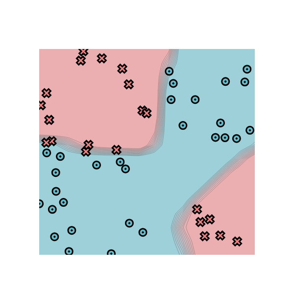

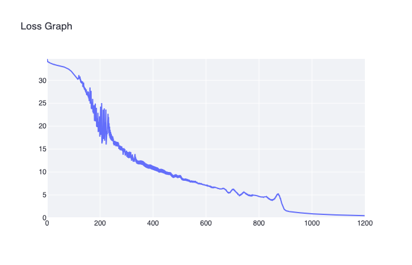


Dataset:

- Circle

Hyperparameters:

- learning rate: 0.5
- epochs: 1200
- hidden layers: 8

Time per epoch: 0.149s

Epoch: 0/1200, loss: 0, correct: 0
Epoch: 10/1200, loss: 32.67443380362066, correct: 33
Epoch: 20/1200, loss: 32.128304450406944, correct: 33
Epoch: 30/1200, loss: 31.691415383367058, correct: 33
Epoch: 40/1200, loss: 31.057828881179383, correct: 33
Epoch: 50/1200, loss: 30.34004562242321, correct: 33
Epoch: 60/1200, loss: 29.737004718671948, correct: 29
Epoch: 70/1200, loss: 29.1841299703538, correct: 31
Epoch: 80/1200, loss: 30.138537478568264, correct: 35
Epoch: 90/1200, loss: 29.151802218936552, correct: 34
Epoch: 100/1200, loss: 28.73090149240783, correct: 37
Epoch: 110/1200, loss: 29.38463571443604, correct: 38
Epoch: 120/1200, loss: 27.880287331119334, correct: 41
Epoch: 130/1200, loss: 29.280819702756624, correct: 39
Epoch: 140/1200, loss: 26.996090108107577, correct: 42
Epoch: 150/1200, loss: 26.775575660079856, correct: 42
Epoch: 160/1200, loss: 27.334373769681406, correct: 41
Epoch: 170/1200, loss: 25.606505163342803, correct: 42
Epoch: 180/1200, loss: 25.863484193957362, correct: 43
Epoch: 190/1200, loss: 25.500308402510317, correct: 42
Epoch: 200/1200, loss: 24.05736805738744, correct: 43
Epoch: 210/1200, loss: 26.0806544469626, correct: 41
Epoch: 220/1200, loss: 23.598131045927115, correct: 43
Epoch: 230/1200, loss: 22.792615295459868, correct: 43
Epoch: 240/1200, loss: 21.689158795019065, correct: 43
Epoch: 250/1200, loss: 21.718212074309402, correct: 42
Epoch: 260/1200, loss: 21.49321220849539, correct: 42
Epoch: 270/1200, loss: 21.37113503153008, correct: 41
Epoch: 280/1200, loss: 20.800101785338885, correct: 41
Epoch: 290/1200, loss: 20.153077546712094, correct: 41
Epoch: 300/1200, loss: 18.979425645170686, correct: 42
Epoch: 310/1200, loss: 18.477698295641076, correct: 42
Epoch: 320/1200, loss: 16.971486953766483, correct: 42
Epoch: 330/1200, loss: 16.088145810851206, correct: 42
Epoch: 340/1200, loss: 14.716650360986527, correct: 43
Epoch: 350/1200, loss: 15.830331956153822, correct: 41
Epoch: 360/1200, loss: 13.60035952403164, correct: 44
Epoch: 370/1200, loss: 12.117916546201275, correct: 44
Epoch: 380/1200, loss: 11.701586550648317, correct: 44
Epoch: 390/1200, loss: 15.099501445052397, correct: 43
Epoch: 400/1200, loss: 10.58944779556726, correct: 46
Epoch: 410/1200, loss: 9.085222247464026, correct: 47
Epoch: 420/1200, loss: 7.706315413974034, correct: 48
Epoch: 430/1200, loss: 28.969998161131155, correct: 37
Epoch: 440/1200, loss: 8.658636723332796, correct: 47
Epoch: 450/1200, loss: 10.680008101011289, correct: 43
Epoch: 460/1200, loss: 9.957801094488925, correct: 45
Epoch: 470/1200, loss: 26.74180513311273, correct: 42
Epoch: 480/1200, loss: 5.604569293841771, correct: 49
Epoch: 490/1200, loss: 49.49722225568908, correct: 34
Epoch: 500/1200, loss: 7.361190184376249, correct: 47
Epoch: 510/1200, loss: 16.68889420503234, correct: 42
Epoch: 520/1200, loss: 7.595263875292007, correct: 47
Epoch: 530/1200, loss: 7.943864780151799, correct: 47
Epoch: 540/1200, loss: 8.52051606214876, correct: 47
Epoch: 550/1200, loss: 7.70408738603492, correct: 47
Epoch: 560/1200, loss: 6.0461130213008545, correct: 48
Epoch: 570/1200, loss: 5.798303479511163, correct: 48
Epoch: 580/1200, loss: 5.235827198914819, correct: 48
Epoch: 590/1200, loss: 4.926181670203222, correct: 48
Epoch: 600/1200, loss: 4.7215629681790094, correct: 48
Epoch: 610/1200, loss: 4.544836593091228, correct: 48
Epoch: 620/1200, loss: 4.387904036151769, correct: 48
Epoch: 630/1200, loss: 4.250788196612516, correct: 48
Epoch: 640/1200, loss: 4.132887052397736, correct: 48
Epoch: 650/1200, loss: 4.040207040858744, correct: 48
Epoch: 660/1200, loss: 4.01622593665588, correct: 48
Epoch: 670/1200, loss: 12.164744548709924, correct: 44
Epoch: 680/1200, loss: 8.971554995518895, correct: 47
Epoch: 690/1200, loss: 2.995400257424394, correct: 50
Epoch: 700/1200, loss: 2.8167221151596222, correct: 49
Epoch: 710/1200, loss: 2.6177059468861437, correct: 50
Epoch: 720/1200, loss: 6.0132765892368, correct: 48
Epoch: 730/1200, loss: 5.7505626809693915, correct: 48
Epoch: 740/1200, loss: 5.444890885974452, correct: 48
Epoch: 750/1200, loss: 5.217647772821773, correct: 48
Epoch: 760/1200, loss: 5.065742965482771, correct: 48
Epoch: 770/1200, loss: 4.8394115221034095, correct: 48
Epoch: 780/1200, loss: 4.721594930453848, correct: 48
Epoch: 790/1200, loss: 4.610800285960759, correct: 48
Epoch: 800/1200, loss: 4.500984596463383, correct: 48
Epoch: 810/1200, loss: 4.368263193887073, correct: 48
Epoch: 820/1200, loss: 4.270176059274085, correct: 48
Epoch: 830/1200, loss: 4.173546858892755, correct: 48
Epoch: 840/1200, loss: 4.073753577190446, correct: 48
Epoch: 850/1200, loss: 3.968299769243759, correct: 48
Epoch: 860/1200, loss: 3.8543793722699804, correct: 48
Epoch: 870/1200, loss: 3.766379315904392, correct: 48
Epoch: 880/1200, loss: 3.557206927093558, correct: 48
Epoch: 890/1200, loss: 3.380006867425978, correct: 48
Epoch: 900/1200, loss: 3.0994366524517365, correct: 48
Epoch: 910/1200, loss: 1.2947904621624344, correct: 50
Epoch: 920/1200, loss: 0.9621668285905269, correct: 50
Epoch: 930/1200, loss: 0.8763205680640556, correct: 50
Epoch: 940/1200, loss: 0.8325680762073359, correct: 50
Epoch: 950/1200, loss: 0.7938460512839765, correct: 50
Epoch: 960/1200, loss: 0.7588451503158502, correct: 50
Epoch: 970/1200, loss: 0.7269487783386043, correct: 50
Epoch: 980/1200, loss: 0.6976953005740887, correct: 50
Epoch: 990/1200, loss: 0.670723727754336, correct: 50
Epoch: 1000/1200, loss: 0.6457433287113132, correct: 50
Epoch: 1010/1200, loss: 0.622519178139531, correct: 50
Epoch: 1020/1200, loss: 0.6008564986556948, correct: 50
Epoch: 1030/1200, loss: 0.5805916254265364, correct: 50
Epoch: 1040/1200, loss: 0.561585392334386, correct: 50
Epoch: 1050/1200, loss: 0.543718187796551, correct: 50
Epoch: 1060/1200, loss: 0.5268863860019036, correct: 50
Epoch: 1070/1200, loss: 0.5110061925838819, correct: 50
Epoch: 1080/1200, loss: 0.4959927235261808, correct: 50
Epoch: 1090/1200, loss: 0.4817742270963264, correct: 50
Epoch: 1100/1200, loss: 0.46828808597056365, correct: 50
Epoch: 1110/1200, loss: 0.45547838864464624, correct: 50
Epoch: 1120/1200, loss: 0.4432950020817569, correct: 50
Epoch: 1130/1200, loss: 0.43169280436330376, correct: 50
Epoch: 1140/1200, loss: 0.4206310439422808, correct: 50
Epoch: 1150/1200, loss: 0.41007280025652204, correct: 50
Epoch: 1160/1200, loss: 0.3999845263693744, correct: 50
Epoch: 1170/1200, loss: 0.3903356586386477, correct: 50
Epoch: 1180/1200, loss: 0.3810982816369578, correct: 50
Epoch: 1190/1200, loss: 0.3722468389754592, correct: 50
Epoch: 1200/1200, loss: 0.36375788253675484, correct: 50

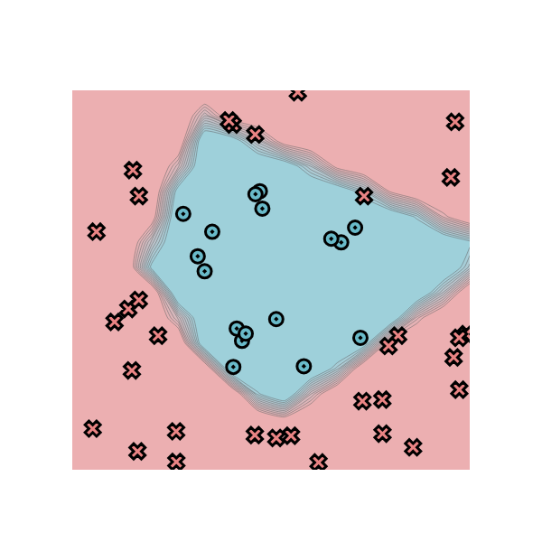

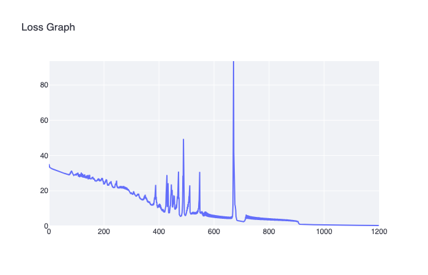


Dataset:

- Spiral

Hyperparameters:

- learning rate: 0.5
- epochs: 5000
- hidden layers: 8

Time per epoch: 0.147s


Epoch: 0/5000, loss: 0, correct: 0
Epoch: 10/5000, loss: 33.816806677021646, correct: 30
Epoch: 20/5000, loss: 33.73988710326445, correct: 31
Epoch: 30/5000, loss: 33.65933562474714, correct: 31
Epoch: 40/5000, loss: 33.67283400031336, correct: 28
Epoch: 50/5000, loss: 33.56385876820045, correct: 31
Epoch: 60/5000, loss: 33.48816840121288, correct: 30
Epoch: 70/5000, loss: 33.489763227954136, correct: 31
Epoch: 80/5000, loss: 33.42094532607294, correct: 28
Epoch: 90/5000, loss: 33.40107490760266, correct: 32
Epoch: 100/5000, loss: 33.378491382964796, correct: 32
Epoch: 110/5000, loss: 33.36632018758753, correct: 32
Epoch: 120/5000, loss: 33.34180981760849, correct: 32
Epoch: 130/5000, loss: 33.41198075515663, correct: 30
Epoch: 140/5000, loss: 33.29204787632703, correct: 33
Epoch: 150/5000, loss: 33.38784599397592, correct: 30
Epoch: 160/5000, loss: 33.29525606636332, correct: 31
Epoch: 170/5000, loss: 33.25912477874574, correct: 33
Epoch: 180/5000, loss: 33.24694259560212, correct: 32
Epoch: 190/5000, loss: 33.24248816122563, correct: 32
Epoch: 200/5000, loss: 33.212213538074074, correct: 33
Epoch: 210/5000, loss: 33.33560059571208, correct: 30
Epoch: 220/5000, loss: 33.334668997551404, correct: 30
Epoch: 230/5000, loss: 33.20429493277611, correct: 32
Epoch: 240/5000, loss: 33.20565460156391, correct: 31
Epoch: 250/5000, loss: 33.1912316706473, correct: 31
Epoch: 260/5000, loss: 33.18429315655233, correct: 32
Epoch: 270/5000, loss: 33.26866055318979, correct: 30
Epoch: 280/5000, loss: 33.16700763576724, correct: 32
Epoch: 290/5000, loss: 33.13195355852241, correct: 31
Epoch: 300/5000, loss: 33.262187224697925, correct: 30
Epoch: 310/5000, loss: 33.19274412533439, correct: 31
Epoch: 320/5000, loss: 33.09157946673366, correct: 32
Epoch: 330/5000, loss: 33.127279773259616, correct: 32
Epoch: 340/5000, loss: 33.2920439581094, correct: 30
Epoch: 350/5000, loss: 33.197017704566484, correct: 31
Epoch: 360/5000, loss: 33.113468400652295, correct: 31
Epoch: 370/5000, loss: 33.15312154733055, correct: 31
Epoch: 380/5000, loss: 33.03712428230969, correct: 32
Epoch: 390/5000, loss: 33.204988368894405, correct: 30
Epoch: 400/5000, loss: 33.00822530514176, correct: 32
Epoch: 410/5000, loss: 33.01066415546512, correct: 32
Epoch: 420/5000, loss: 33.03348700592969, correct: 32
Epoch: 430/5000, loss: 33.02043442085692, correct: 32
Epoch: 440/5000, loss: 32.975075535272836, correct: 32
Epoch: 450/5000, loss: 33.048517029581795, correct: 33
Epoch: 460/5000, loss: 33.18878650794222, correct: 30
Epoch: 470/5000, loss: 33.17022941086015, correct: 30
Epoch: 480/5000, loss: 33.00009023893156, correct: 33
Epoch: 490/5000, loss: 32.937764453210214, correct: 32
Epoch: 500/5000, loss: 32.967169327588024, correct: 31
Epoch: 510/5000, loss: 33.04699325409938, correct: 30
Epoch: 520/5000, loss: 32.98962078480591, correct: 33
Epoch: 530/5000, loss: 32.93745065235196, correct: 33
Epoch: 540/5000, loss: 33.12233116168883, correct: 30
Epoch: 550/5000, loss: 32.951427083411275, correct: 31
Epoch: 560/5000, loss: 32.88502532096922, correct: 33
Epoch: 570/5000, loss: 32.90806996637724, correct: 33
Epoch: 580/5000, loss: 32.94654317444513, correct: 32
Epoch: 590/5000, loss: 32.866822498179936, correct: 33
Epoch: 600/5000, loss: 32.91075479877529, correct: 33
Epoch: 610/5000, loss: 32.85130303009179, correct: 33
Epoch: 620/5000, loss: 32.83793418354743, correct: 32
Epoch: 630/5000, loss: 32.9871066473043, correct: 31
Epoch: 640/5000, loss: 32.80070197299506, correct: 32
Epoch: 650/5000, loss: 32.820617760529316, correct: 33
Epoch: 660/5000, loss: 32.77044151734126, correct: 33
Epoch: 670/5000, loss: 32.94268470696166, correct: 30
Epoch: 680/5000, loss: 32.844570468707104, correct: 32
Epoch: 690/5000, loss: 32.7162235886557, correct: 33
Epoch: 700/5000, loss: 32.80098955393959, correct: 32
Epoch: 710/5000, loss: 32.7546150974732, correct: 32
Epoch: 720/5000, loss: 32.665304310890086, correct: 33
Epoch: 730/5000, loss: 32.749844656927905, correct: 32
Epoch: 740/5000, loss: 32.876198757684676, correct: 32
Epoch: 750/5000, loss: 32.66577804328628, correct: 33
Epoch: 760/5000, loss: 32.86618214777365, correct: 30
Epoch: 770/5000, loss: 32.843297451763505, correct: 31
Epoch: 780/5000, loss: 32.661134500745604, correct: 32
Epoch: 790/5000, loss: 33.08025150074411, correct: 31
Epoch: 800/5000, loss: 32.74566244921021, correct: 30
Epoch: 810/5000, loss: 32.59241587619409, correct: 31
Epoch: 820/5000, loss: 33.030819889375124, correct: 30
Epoch: 830/5000, loss: 32.652664687452685, correct: 30
Epoch: 840/5000, loss: 32.51518356301676, correct: 32
Epoch: 850/5000, loss: 33.0225749551826, correct: 30
Epoch: 860/5000, loss: 32.99236507659591, correct: 29
Epoch: 870/5000, loss: 32.78601881816137, correct: 30
Epoch: 880/5000, loss: 32.88407227283005, correct: 29
Epoch: 890/5000, loss: 32.928363541962476, correct: 29
Epoch: 900/5000, loss: 32.53755638480279, correct: 32
Epoch: 910/5000, loss: 32.74504456567229, correct: 30
Epoch: 920/5000, loss: 32.87523510866602, correct: 29
Epoch: 930/5000, loss: 32.87787910445814, correct: 31
Epoch: 940/5000, loss: 32.40778886349913, correct: 33
Epoch: 950/5000, loss: 32.77089967603809, correct: 30
Epoch: 960/5000, loss: 32.263146432476276, correct: 33
Epoch: 970/5000, loss: 32.4180405578381, correct: 33
Epoch: 980/5000, loss: 32.24978302344414, correct: 33
Epoch: 990/5000, loss: 32.350305424748626, correct: 32
Epoch: 1000/5000, loss: 32.837543819618084, correct: 30
Epoch: 1010/5000, loss: 32.85305068717666, correct: 30
Epoch: 1020/5000, loss: 32.59344108608934, correct: 31
Epoch: 1030/5000, loss: 32.547832401093146, correct: 31
Epoch: 1040/5000, loss: 32.70365219070837, correct: 30
Epoch: 1050/5000, loss: 32.76451579536421, correct: 30
Epoch: 1060/5000, loss: 32.663711487030994, correct: 30
Epoch: 1070/5000, loss: 32.67232878844858, correct: 30
Epoch: 1080/5000, loss: 32.8231587971283, correct: 30
Epoch: 1090/5000, loss: 32.73938383323682, correct: 30
Epoch: 1100/5000, loss: 32.08582304005176, correct: 31
Epoch: 1110/5000, loss: 32.502071738470185, correct: 30
Epoch: 1120/5000, loss: 32.1756410446058, correct: 31
Epoch: 1130/5000, loss: 32.56864953426252, correct: 30
Epoch: 1140/5000, loss: 32.58251696091876, correct: 30
Epoch: 1150/5000, loss: 32.552411853122464, correct: 30
Epoch: 1160/5000, loss: 32.195888232657815, correct: 30
Epoch: 1170/5000, loss: 32.0523755093064, correct: 31
Epoch: 1180/5000, loss: 32.24477886045202, correct: 30
Epoch: 1190/5000, loss: 32.217335352449645, correct: 30
Epoch: 1200/5000, loss: 32.250581696036996, correct: 30
Epoch: 1210/5000, loss: 32.337872469270664, correct: 30
Epoch: 1220/5000, loss: 32.05071058382611, correct: 30
Epoch: 1230/5000, loss: 32.107577344432684, correct: 30
Epoch: 1240/5000, loss: 32.007121026296275, correct: 30
Epoch: 1250/5000, loss: 32.057788337210866, correct: 30
Epoch: 1260/5000, loss: 32.08558348475127, correct: 30
Epoch: 1270/5000, loss: 32.287965848306015, correct: 30
Epoch: 1280/5000, loss: 32.370414032671064, correct: 30
Epoch: 1290/5000, loss: 32.106255967678855, correct: 30
Epoch: 1300/5000, loss: 32.10203736419701, correct: 30
Epoch: 1310/5000, loss: 32.199953742927036, correct: 30
Epoch: 1320/5000, loss: 32.18906801486344, correct: 30
Epoch: 1330/5000, loss: 32.07717046110411, correct: 30
Epoch: 1340/5000, loss: 32.13451644481986, correct: 30
Epoch: 1350/5000, loss: 32.18134101966172, correct: 30
Epoch: 1360/5000, loss: 31.98151016335951, correct: 30
Epoch: 1370/5000, loss: 32.1743502905781, correct: 30
Epoch: 1380/5000, loss: 31.888266574760216, correct: 30
Epoch: 1390/5000, loss: 32.22607968085953, correct: 30
Epoch: 1400/5000, loss: 31.955459133480847, correct: 30
Epoch: 1410/5000, loss: 31.694214824209514, correct: 30
Epoch: 1420/5000, loss: 31.56227531945347, correct: 30
Epoch: 1430/5000, loss: 31.516985168748278, correct: 30
Epoch: 1440/5000, loss: 31.704529748235686, correct: 30
Epoch: 1450/5000, loss: 32.27809403438189, correct: 30
Epoch: 1460/5000, loss: 32.1635493835352, correct: 30
Epoch: 1470/5000, loss: 31.405158933412753, correct: 30
Epoch: 1480/5000, loss: 31.84113456226123, correct: 30
Epoch: 1490/5000, loss: 31.24829241237219, correct: 30
Epoch: 1500/5000, loss: 32.623406767647495, correct: 30
Epoch: 1510/5000, loss: 31.62638161866325, correct: 30
Epoch: 1520/5000, loss: 32.156858964847544, correct: 30
Epoch: 1530/5000, loss: 31.611759923331565, correct: 31
Epoch: 1540/5000, loss: 31.8733110853315, correct: 31
Epoch: 1550/5000, loss: 31.558628953482224, correct: 30
Epoch: 1560/5000, loss: 31.329020531239557, correct: 30
Epoch: 1570/5000, loss: 31.61677474583454, correct: 30
Epoch: 1580/5000, loss: 30.100004834907395, correct: 35
Epoch: 1590/5000, loss: 32.75168033784721, correct: 31
Epoch: 1600/5000, loss: 32.08643341076694, correct: 32
Epoch: 1610/5000, loss: 31.40871008117536, correct: 35
Epoch: 1620/5000, loss: 32.012015099418015, correct: 32
Epoch: 1630/5000, loss: 29.87287241633762, correct: 39
Epoch: 1640/5000, loss: 29.95428450427478, correct: 39
Epoch: 1650/5000, loss: 32.518559841410195, correct: 31
Epoch: 1660/5000, loss: 32.013096376291266, correct: 33
Epoch: 1670/5000, loss: 32.2815334382749, correct: 32
Epoch: 1680/5000, loss: 32.61621227798207, correct: 31
Epoch: 1690/5000, loss: 31.947907660993234, correct: 32
Epoch: 1700/5000, loss: 31.776883790814665, correct: 33
Epoch: 1710/5000, loss: 31.045292570158022, correct: 34
Epoch: 1720/5000, loss: 31.379999442766135, correct: 32
Epoch: 1730/5000, loss: 31.508173501155515, correct: 33
Epoch: 1740/5000, loss: 30.934024179191162, correct: 33
Epoch: 1750/5000, loss: 31.216629150080024, correct: 33
Epoch: 1760/5000, loss: 31.033888173594843, correct: 32
Epoch: 1770/5000, loss: 31.41918919247936, correct: 33
Epoch: 1780/5000, loss: 31.768567986543392, correct: 32
Epoch: 1790/5000, loss: 30.97687605799553, correct: 34
Epoch: 1800/5000, loss: 31.369852811690862, correct: 32
Epoch: 1810/5000, loss: 31.278141691081007, correct: 34
Epoch: 1820/5000, loss: 32.14020938586101, correct: 34
Epoch: 1830/5000, loss: 31.58624695881221, correct: 33
Epoch: 1840/5000, loss: 30.594639530879785, correct: 33
Epoch: 1850/5000, loss: 30.918553747445777, correct: 32
Epoch: 1860/5000, loss: 32.003606098462015, correct: 32
Epoch: 1870/5000, loss: 30.70695004835755, correct: 34
Epoch: 1880/5000, loss: 32.1985859072605, correct: 33
Epoch: 1890/5000, loss: 30.703714339351844, correct: 34
Epoch: 1900/5000, loss: 31.837065239304607, correct: 33
Epoch: 1910/5000, loss: 31.6614062718463, correct: 33
Epoch: 1920/5000, loss: 31.40134830465309, correct: 34
Epoch: 1930/5000, loss: 31.33972901118551, correct: 34
Epoch: 1940/5000, loss: 30.0578211192603, correct: 34
Epoch: 1950/5000, loss: 31.23154559130078, correct: 34
Epoch: 1960/5000, loss: 30.584901728552722, correct: 34
Epoch: 1970/5000, loss: 30.349023831265725, correct: 33
Epoch: 1980/5000, loss: 31.34365971115757, correct: 32
Epoch: 1990/5000, loss: 31.907574366520606, correct: 33
Epoch: 2000/5000, loss: 30.360815160840563, correct: 33
Epoch: 2010/5000, loss: 30.40164963111246, correct: 33
Epoch: 2020/5000, loss: 30.21713046469521, correct: 34
Epoch: 2030/5000, loss: 31.633976481719177, correct: 33
Epoch: 2040/5000, loss: 31.625327357511757, correct: 33
Epoch: 2050/5000, loss: 29.902430573407656, correct: 34
Epoch: 2060/5000, loss: 30.33682452383045, correct: 34
Epoch: 2070/5000, loss: 30.118218060578315, correct: 34
Epoch: 2080/5000, loss: 31.57891284686775, correct: 33
Epoch: 2090/5000, loss: 30.54759291403651, correct: 33
Epoch: 2100/5000, loss: 30.228501135409267, correct: 34
Epoch: 2110/5000, loss: 30.20080735710639, correct: 32
Epoch: 2120/5000, loss: 31.57516108125367, correct: 33
Epoch: 2130/5000, loss: 30.140626146331144, correct: 33
Epoch: 2140/5000, loss: 30.69872259841826, correct: 34
Epoch: 2150/5000, loss: 30.442868408921303, correct: 35
Epoch: 2160/5000, loss: 29.855778724511385, correct: 31
Epoch: 2170/5000, loss: 30.420197527210092, correct: 34
Epoch: 2180/5000, loss: 30.2204395274701, correct: 34
Epoch: 2190/5000, loss: 29.90880937399774, correct: 34
Epoch: 2200/5000, loss: 30.454683259636774, correct: 33
Epoch: 2210/5000, loss: 29.24960406584293, correct: 34
Epoch: 2220/5000, loss: 30.25098880132441, correct: 34
Epoch: 2230/5000, loss: 29.898194003724942, correct: 32
Epoch: 2240/5000, loss: 28.896003544951157, correct: 33
Epoch: 2250/5000, loss: 29.186213757944518, correct: 35
Epoch: 2260/5000, loss: 28.502199299627335, correct: 36
Epoch: 2270/5000, loss: 30.07120955158002, correct: 32
Epoch: 2280/5000, loss: 30.782621749303956, correct: 32
Epoch: 2290/5000, loss: 28.574455636466546, correct: 37
Epoch: 2300/5000, loss: 27.00240783904134, correct: 38
Epoch: 2310/5000, loss: 26.544204537808255, correct: 37
Epoch: 2320/5000, loss: 31.395009257013744, correct: 33
Epoch: 2330/5000, loss: 29.78393222077492, correct: 34
Epoch: 2340/5000, loss: 34.07897144206208, correct: 32
Epoch: 2350/5000, loss: 29.086167517598305, correct: 35
Epoch: 2360/5000, loss: 38.21260837502695, correct: 24
Epoch: 2370/5000, loss: 28.204219449650537, correct: 39
Epoch: 2380/5000, loss: 30.994485406588467, correct: 34
Epoch: 2390/5000, loss: 28.37245299299451, correct: 38
Epoch: 2400/5000, loss: 31.99147682039093, correct: 30
Epoch: 2410/5000, loss: 39.59507577199985, correct: 24
Epoch: 2420/5000, loss: 31.698822519923446, correct: 31
Epoch: 2430/5000, loss: 29.057783636910933, correct: 33
Epoch: 2440/5000, loss: 30.008264760511477, correct: 33
Epoch: 2450/5000, loss: 32.05037198897785, correct: 33
Epoch: 2460/5000, loss: 30.22951162762711, correct: 34
Epoch: 2470/5000, loss: 34.93535280502925, correct: 27
Epoch: 2480/5000, loss: 35.63169663847677, correct: 27
Epoch: 2490/5000, loss: 27.191353672486947, correct: 38
Epoch: 2500/5000, loss: 27.429981014597246, correct: 37
Epoch: 2510/5000, loss: 26.43351637973784, correct: 39
Epoch: 2520/5000, loss: 28.488417693146822, correct: 35
Epoch: 2530/5000, loss: 26.540565803635882, correct: 38
Epoch: 2540/5000, loss: 24.445156489314112, correct: 41
Epoch: 2550/5000, loss: 29.91755046715955, correct: 34
Epoch: 2560/5000, loss: 30.45099122308171, correct: 33
Epoch: 2570/5000, loss: 27.43224726714511, correct: 36
Epoch: 2580/5000, loss: 27.496618369983025, correct: 34
Epoch: 2590/5000, loss: 24.86384502204152, correct: 39
Epoch: 2600/5000, loss: 27.63129806543233, correct: 34
Epoch: 2610/5000, loss: 36.40192791709242, correct: 28
Epoch: 2620/5000, loss: 29.989470688023914, correct: 34
Epoch: 2630/5000, loss: 27.92819067973427, correct: 34
Epoch: 2640/5000, loss: 29.743298314092083, correct: 30
Epoch: 2650/5000, loss: 26.015217268265232, correct: 40
Epoch: 2660/5000, loss: 32.3626996413736, correct: 30
Epoch: 2670/5000, loss: 38.92670725938452, correct: 25
Epoch: 2680/5000, loss: 27.066161194222097, correct: 35
Epoch: 2690/5000, loss: 28.407230862758166, correct: 34
Epoch: 2700/5000, loss: 26.474832329976593, correct: 32
Epoch: 2710/5000, loss: 31.970707361369623, correct: 29
Epoch: 2720/5000, loss: 26.977708224422862, correct: 29
Epoch: 2730/5000, loss: 22.86268133023431, correct: 42
Epoch: 2740/5000, loss: 23.22884575875884, correct: 40
Epoch: 2750/5000, loss: 26.99263863348041, correct: 36
Epoch: 2760/5000, loss: 36.948183932050824, correct: 26
Epoch: 2770/5000, loss: 30.8370846066002, correct: 31
Epoch: 2780/5000, loss: 32.45751715027909, correct: 28
Epoch: 2790/5000, loss: 41.28708645235997, correct: 26
Epoch: 2800/5000, loss: 27.054496612656123, correct: 35
Epoch: 2810/5000, loss: 24.41278052120499, correct: 40
Epoch: 2820/5000, loss: 24.65371181310387, correct: 39
Epoch: 2830/5000, loss: 22.755916542702067, correct: 40
Epoch: 2840/5000, loss: 31.54818066136882, correct: 33
Epoch: 2850/5000, loss: 28.805401460464985, correct: 33
Epoch: 2860/5000, loss: 21.85791733908027, correct: 43
Epoch: 2870/5000, loss: 36.96642126848148, correct: 29
Epoch: 2880/5000, loss: 31.925668634976944, correct: 32
Epoch: 2890/5000, loss: 43.205267421115266, correct: 22
Epoch: 2900/5000, loss: 24.090145360974297, correct: 41
Epoch: 2910/5000, loss: 32.18825523897099, correct: 31
Epoch: 2920/5000, loss: 23.14743283247559, correct: 40
Epoch: 2930/5000, loss: 47.49502201989742, correct: 22
Epoch: 2940/5000, loss: 22.421420704732235, correct: 42
Epoch: 2950/5000, loss: 33.29671760631341, correct: 32
Epoch: 2960/5000, loss: 25.181365538005814, correct: 39
Epoch: 2970/5000, loss: 30.075184455944612, correct: 35
Epoch: 2980/5000, loss: 26.730269290571453, correct: 34
Epoch: 2990/5000, loss: 32.08935515355435, correct: 31
Epoch: 3000/5000, loss: 24.361576604043414, correct: 37
Epoch: 3010/5000, loss: 34.52826922293582, correct: 30
Epoch: 3020/5000, loss: 29.4302281195829, correct: 35
Epoch: 3030/5000, loss: 30.654431659105274, correct: 32
Epoch: 3040/5000, loss: 31.162757381518972, correct: 32
Epoch: 3050/5000, loss: 32.10379719814322, correct: 31
Epoch: 3060/5000, loss: 40.93126972661532, correct: 26
Epoch: 3070/5000, loss: 29.656956047989464, correct: 31
Epoch: 3080/5000, loss: 28.96370714992647, correct: 33
Epoch: 3090/5000, loss: 29.582949760918737, correct: 34
Epoch: 3100/5000, loss: 35.722037149901425, correct: 30
Epoch: 3110/5000, loss: 28.351298242496174, correct: 39
Epoch: 3120/5000, loss: 25.075850247360712, correct: 38
Epoch: 3130/5000, loss: 36.79128546574187, correct: 30
Epoch: 3140/5000, loss: 23.99159351499683, correct: 39
Epoch: 3150/5000, loss: 27.3179782724992, correct: 37
Epoch: 3160/5000, loss: 24.997065338240112, correct: 39
Epoch: 3170/5000, loss: 29.9385075131699, correct: 33
Epoch: 3180/5000, loss: 31.72861566499229, correct: 30
Epoch: 3190/5000, loss: 20.898945507633332, correct: 43
Epoch: 3200/5000, loss: 22.77414139153149, correct: 39
Epoch: 3210/5000, loss: 22.042015319912842, correct: 40
Epoch: 3220/5000, loss: 21.04117551312752, correct: 40
Epoch: 3230/5000, loss: 30.762140896251832, correct: 33
Epoch: 3240/5000, loss: 24.00456902735096, correct: 41
Epoch: 3250/5000, loss: 20.051445031922068, correct: 43
Epoch: 3260/5000, loss: 23.21125771123634, correct: 40
Epoch: 3270/5000, loss: 38.46482500343801, correct: 29
Epoch: 3280/5000, loss: 22.088774324175183, correct: 40
Epoch: 3290/5000, loss: 24.826836628578, correct: 37
Epoch: 3300/5000, loss: 30.751692902020746, correct: 30
Epoch: 3310/5000, loss: 23.93636657625781, correct: 38
Epoch: 3320/5000, loss: 26.31883182105251, correct: 35
Epoch: 3330/5000, loss: 19.54519996718088, correct: 43
Epoch: 3340/5000, loss: 22.86589826132595, correct: 40
Epoch: 3350/5000, loss: 37.92275212133851, correct: 31
Epoch: 3360/5000, loss: 24.24424258360903, correct: 36
Epoch: 3370/5000, loss: 27.949828722652576, correct: 33
Epoch: 3380/5000, loss: 23.95720935912511, correct: 41
Epoch: 3390/5000, loss: 23.658182846408554, correct: 37
Epoch: 3400/5000, loss: 21.86945001115424, correct: 44
Epoch: 3410/5000, loss: 28.28902272795272, correct: 35
Epoch: 3420/5000, loss: 25.65208773798075, correct: 37
Epoch: 3430/5000, loss: 21.94527900412324, correct: 40
Epoch: 3440/5000, loss: 22.294861340898052, correct: 43
Epoch: 3450/5000, loss: 23.580195642945384, correct: 39
Epoch: 3460/5000, loss: 42.26921717962992, correct: 26
Epoch: 3470/5000, loss: 25.86890387930839, correct: 35
Epoch: 3480/5000, loss: 30.722448062004013, correct: 33
Epoch: 3490/5000, loss: 41.64767757286978, correct: 29
Epoch: 3500/5000, loss: 36.22329383793405, correct: 30
Epoch: 3510/5000, loss: 22.714967744161285, correct: 40
Epoch: 3520/5000, loss: 22.34794139243489, correct: 41
Epoch: 3530/5000, loss: 26.74356481506787, correct: 37
Epoch: 3540/5000, loss: 19.08222459164453, correct: 44
Epoch: 3550/5000, loss: 23.967320701262967, correct: 37
Epoch: 3560/5000, loss: 19.951273920657222, correct: 40
Epoch: 3570/5000, loss: 22.63269333583862, correct: 38
Epoch: 3580/5000, loss: 21.152912111627604, correct: 39
Epoch: 3590/5000, loss: 25.936010003576207, correct: 34
Epoch: 3600/5000, loss: 26.301896773339855, correct: 33
Epoch: 3610/5000, loss: 20.89185479636954, correct: 41
Epoch: 3620/5000, loss: 24.55963023820899, correct: 36
Epoch: 3630/5000, loss: 22.159358348325632, correct: 38
Epoch: 3640/5000, loss: 46.56574631735471, correct: 25
Epoch: 3650/5000, loss: 21.8091791092888, correct: 42
Epoch: 3660/5000, loss: 23.6325250246442, correct: 38
Epoch: 3670/5000, loss: 21.11123410099655, correct: 42
Epoch: 3680/5000, loss: 24.860372085208283, correct: 38
Epoch: 3690/5000, loss: 19.080621634504787, correct: 44
Epoch: 3700/5000, loss: 20.791961785484016, correct: 37
Epoch: 3710/5000, loss: 34.785858325583185, correct: 30
Epoch: 3720/5000, loss: 25.739989102952148, correct: 37
Epoch: 3730/5000, loss: 19.74386924736244, correct: 40
Epoch: 3740/5000, loss: 24.494551641671524, correct: 37
Epoch: 3750/5000, loss: 18.142654536423812, correct: 43
Epoch: 3760/5000, loss: 38.64040475835541, correct: 30
Epoch: 3770/5000, loss: 18.809479779537916, correct: 42
Epoch: 3780/5000, loss: 31.898889371174594, correct: 31
Epoch: 3790/5000, loss: 20.850142628372136, correct: 38
Epoch: 3800/5000, loss: 19.269565010113727, correct: 44
Epoch: 3810/5000, loss: 28.9229848312187, correct: 31
Epoch: 3820/5000, loss: 21.236762163015516, correct: 40
Epoch: 3830/5000, loss: 29.061141592422253, correct: 32
Epoch: 3840/5000, loss: 22.345604540816858, correct: 40
Epoch: 3850/5000, loss: 22.40509974754393, correct: 39
Epoch: 3860/5000, loss: 19.597966830422013, correct: 43
Epoch: 3870/5000, loss: 20.918599312802833, correct: 36
Epoch: 3880/5000, loss: 28.309681630075303, correct: 35
Epoch: 3890/5000, loss: 19.899218907937094, correct: 40
Epoch: 3900/5000, loss: 21.698703848881856, correct: 40
Epoch: 3910/5000, loss: 18.683421790583335, correct: 40
Epoch: 3920/5000, loss: 40.39664899215279, correct: 31
Epoch: 3930/5000, loss: 27.53992274004845, correct: 35
Epoch: 3940/5000, loss: 19.48197985563835, correct: 40
Epoch: 3950/5000, loss: 24.910332077050388, correct: 34
Epoch: 3960/5000, loss: 18.90724315168474, correct: 42
Epoch: 3970/5000, loss: 33.88563510278403, correct: 28
Epoch: 3980/5000, loss: 18.956795964205153, correct: 40
Epoch: 3990/5000, loss: 50.36050271400994, correct: 27
Epoch: 4000/5000, loss: 19.838188243278456, correct: 39
Epoch: 4010/5000, loss: 34.90952293560387, correct: 33
Epoch: 4020/5000, loss: 24.531355031561006, correct: 40
Epoch: 4030/5000, loss: 32.79532213975133, correct: 32
Epoch: 4040/5000, loss: 17.83211922879335, correct: 42
Epoch: 4050/5000, loss: 17.63916139351033, correct: 44
Epoch: 4060/5000, loss: 28.267797231174125, correct: 37
Epoch: 4070/5000, loss: 19.37541986649048, correct: 44
Epoch: 4080/5000, loss: 41.71388830494582, correct: 27
Epoch: 4090/5000, loss: 18.96660989906296, correct: 40
Epoch: 4100/5000, loss: 23.198072553106044, correct: 40
Epoch: 4110/5000, loss: 33.30674722905876, correct: 29
Epoch: 4120/5000, loss: 24.797078340025184, correct: 37
Epoch: 4130/5000, loss: 29.83124815511312, correct: 35
Epoch: 4140/5000, loss: 16.626204634089564, correct: 44
Epoch: 4150/5000, loss: 18.51772122212448, correct: 42
Epoch: 4160/5000, loss: 54.38337777740575, correct: 27
Epoch: 4170/5000, loss: 15.959705039770721, correct: 44
Epoch: 4180/5000, loss: 33.11860645785903, correct: 29
Epoch: 4190/5000, loss: 34.42479943292385, correct: 34
Epoch: 4200/5000, loss: 29.041266490337495, correct: 31
Epoch: 4210/5000, loss: 21.98584913066954, correct: 37
Epoch: 4220/5000, loss: 20.218406469841764, correct: 40
Epoch: 4230/5000, loss: 27.40492597738437, correct: 34
Epoch: 4240/5000, loss: 18.878509754225785, correct: 38
Epoch: 4250/5000, loss: 29.46585586751087, correct: 36
Epoch: 4260/5000, loss: 20.162191268870288, correct: 38
Epoch: 4270/5000, loss: 31.239365833819456, correct: 34
Epoch: 4280/5000, loss: 23.618888157334332, correct: 36
Epoch: 4290/5000, loss: 21.85158920054096, correct: 38
Epoch: 4300/5000, loss: 16.9591694966394, correct: 44
Epoch: 4310/5000, loss: 39.85290099324603, correct: 29
Epoch: 4320/5000, loss: 24.566748137309116, correct: 35
Epoch: 4330/5000, loss: 15.153269577436228, correct: 46
Epoch: 4340/5000, loss: 30.14024138599001, correct: 28
Epoch: 4350/5000, loss: 21.925208924287546, correct: 41
Epoch: 4360/5000, loss: 15.710955873302767, correct: 48
Epoch: 4370/5000, loss: 30.432080027355866, correct: 34
Epoch: 4380/5000, loss: 16.957391822781577, correct: 47
Epoch: 4390/5000, loss: 36.28465219624229, correct: 29
Epoch: 4400/5000, loss: 22.992346423902877, correct: 35
Epoch: 4410/5000, loss: 21.201658413334744, correct: 39
Epoch: 4420/5000, loss: 24.67866607557204, correct: 37
Epoch: 4430/5000, loss: 15.963090609131383, correct: 45
Epoch: 4440/5000, loss: 40.466195025690936, correct: 32
Epoch: 4450/5000, loss: 14.21543389580159, correct: 47
Epoch: 4460/5000, loss: 29.212882104244166, correct: 37
Epoch: 4470/5000, loss: 21.855547584386933, correct: 34
Epoch: 4480/5000, loss: 15.036355232860767, correct: 45
Epoch: 4490/5000, loss: 25.227436902456187, correct: 38
Epoch: 4500/5000, loss: 15.445928231201568, correct: 42
Epoch: 4510/5000, loss: 32.92537034091515, correct: 32
Epoch: 4520/5000, loss: 14.783164445838175, correct: 47
Epoch: 4530/5000, loss: 26.3902826765535, correct: 33
Epoch: 4540/5000, loss: 30.313549899368084, correct: 30
Epoch: 4550/5000, loss: 22.757731692337604, correct: 41
Epoch: 4560/5000, loss: 28.44481663710041, correct: 31
Epoch: 4570/5000, loss: 15.854751700165655, correct: 44
Epoch: 4580/5000, loss: 15.838610097065569, correct: 42
Epoch: 4590/5000, loss: 20.689223629785623, correct: 45
Epoch: 4600/5000, loss: 15.49663326731531, correct: 47
Epoch: 4610/5000, loss: 38.29188100284342, correct: 30
Epoch: 4620/5000, loss: 13.702253985091254, correct: 46
Epoch: 4630/5000, loss: 20.39724112715766, correct: 41
Epoch: 4640/5000, loss: 28.036540379821044, correct: 34
Epoch: 4650/5000, loss: 26.90312617485538, correct: 32
Epoch: 4660/5000, loss: 24.55747171780778, correct: 35
Epoch: 4670/5000, loss: 18.480420129637167, correct: 41
Epoch: 4680/5000, loss: 13.865847851325379, correct: 45
Epoch: 4690/5000, loss: 14.971938824830353, correct: 43
Epoch: 4700/5000, loss: 32.24641126736821, correct: 42
Epoch: 4710/5000, loss: 15.222309459017287, correct: 43
Epoch: 4720/5000, loss: 29.64864073403983, correct: 38
Epoch: 4730/5000, loss: 13.50173474717637, correct: 48
Epoch: 4740/5000, loss: 15.308272760194704, correct: 45
Epoch: 4750/5000, loss: 23.366678632800607, correct: 38
Epoch: 4760/5000, loss: 13.993815389260552, correct: 45
Epoch: 4770/5000, loss: 15.593907746227673, correct: 42
Epoch: 4780/5000, loss: 14.632646530578564, correct: 44
Epoch: 4790/5000, loss: 41.22837905884068, correct: 29
Epoch: 4800/5000, loss: 12.398067251226639, correct: 48
Epoch: 4810/5000, loss: 43.10766050544987, correct: 30
Epoch: 4820/5000, loss: 20.2440227063678, correct: 39
Epoch: 4830/5000, loss: 13.003457457474877, correct: 48
Epoch: 4840/5000, loss: 49.37152380684034, correct: 27
Epoch: 4850/5000, loss: 12.977082102639118, correct: 46
Epoch: 4860/5000, loss: 21.017298772787544, correct: 38
Epoch: 4870/5000, loss: 34.373377127182856, correct: 38
Epoch: 4880/5000, loss: 25.05788456317134, correct: 41
Epoch: 4890/5000, loss: 21.0341184323969, correct: 43
Epoch: 4900/5000, loss: 20.640716835737923, correct: 41
Epoch: 4910/5000, loss: 20.493539333939555, correct: 41
Epoch: 4920/5000, loss: 21.28057373562463, correct: 37
Epoch: 4930/5000, loss: 19.258014169321054, correct: 43
Epoch: 4940/5000, loss: 20.210253208738425, correct: 42
Epoch: 4950/5000, loss: 20.032665892207387, correct: 42
Epoch: 4960/5000, loss: 18.913972224347976, correct: 43
Epoch: 4970/5000, loss: 19.810085255301196, correct: 40
Epoch: 4980/5000, loss: 18.43515018066712, correct: 42
Epoch: 4990/5000, loss: 19.132372901582954, correct: 41
Epoch: 5000/5000, loss: 17.395416844965798, correct: 42


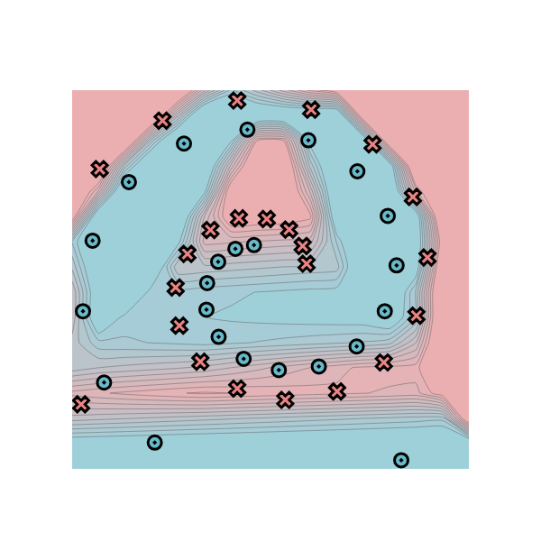

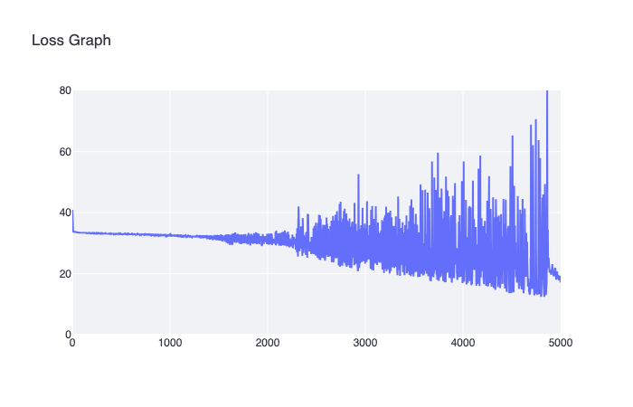
